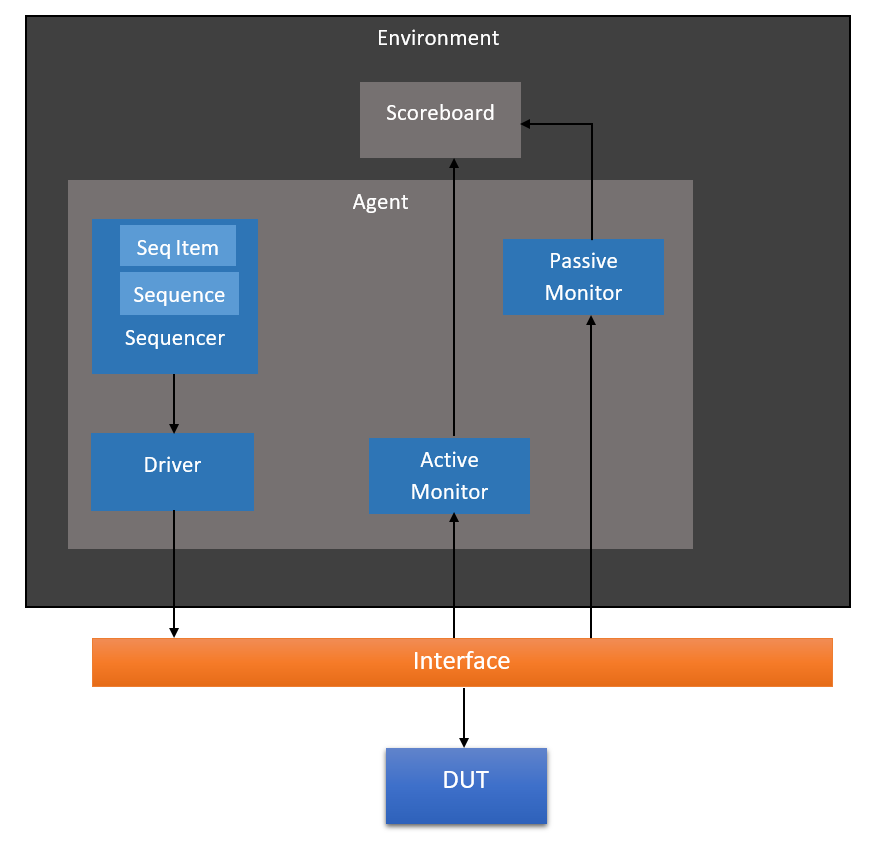

# ALU_Verification_IP
Verification IP for ALU written using SystemVerilog (UVM)

### This Document is organized as follows -
  1.  Project Information
  2.  Code Information
  3.  Usage
  4.  Results
  5.  References

### Project Information
Understanding the flow of data in UVM is pretty confusing. For this project I have used, the below diagram as a reference.

The seq item will randomize operands and opcode and send this packet to the driver. The driver puts this data on the interface. The active monitor/passive monitor samples the data from the interface and converts it into a single packet. The scoreboard calculates the expected data from the packet received from the active monitor. It then compares these packet with the packet received from the passive monitor. If both the packets are same then the testcase is successful.

### Code Information
  1.  Enum is used for different opcodes (see seq_item.sv)
  2.  Two testcases are considered for verifiying the DUT -
      1.  Random opcodes
      2.  Specific opcode
      
      See alu_test.sv The base class contain alu_test contain methods for UVM_Reporting. This base class is extended into alu_test_random
      and alu_test_add. The alu_test_random will randomize the opcodes while the alu_test_add will set the opcode to ADD. User can extend         this class (alu_test) to create there own test-cases for different opcodes.
      Also following the UVM Methodology, every testcase is given a separate sequence. See alu_sequence.sv
      
 ### Usage
  For Questasim Users
  1.  Copy the repository files in your directory
  2.  Open Questasim
  
  Type in the Transcript
  1.  cd <your_directory>
  2.  vlib my_lib
  3.  vmap work my_lib
  4.  vlog alu_top.sv
  5.  vsim alu_top
  6.  run
